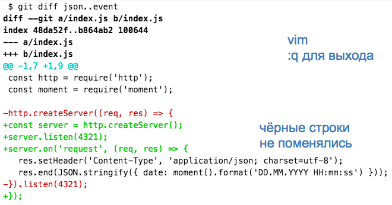

# node_starters0

`mkdir $(date +%Y%m%d_%H%M%S) && cd $_ && git clone -b event https://github.com/GossJS/node_starters0.git . && yarn`

`atom .`

`yarn start`

Для переключения: `git checkout json` или `git checkout simple`

Для создания новой ветви: `git checkout -b new`

Для вывода разницы между этой ветвью и предыдущей:

`git diff json..event`

или конкретно для файла со сценарием:

`git diff json event -- index.js`

